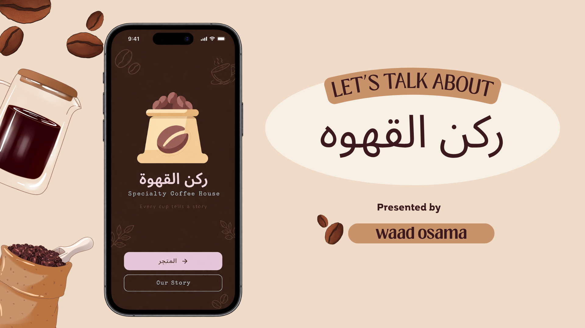

#   Specialty Coffee ركن القهوه



A specialty coffee shop app built with **Flutter**, featuring an animated intro (splash) screen and a live drink menu loaded from a remote API. Designed with a warm, professional coffee-shop visual theme using a shared color palette, Google Fonts, and custom painters.

---

## ✨ Features

- **Animated Intro Page** — A roastery "label" poster: coffee-bag hero inside an arched window, a rotating wax-seal stamp biting into the paper card, a halftone/sunburst printed backdrop, staggered entrance animations, brand title, tagline, and navigation buttons leading to the menu.
- **Live Menu** — Drinks fetched remotely (`/api/coffee/v1/drinks?type=hot`) and displayed in a 2-column card grid.
- **Product Details Page** — Tapping any drink opens a full-screen page with its tasting note, price in EGP, a quantity selector, and an **Add to Cart** action.
- **Shopping Cart** — A `CartCubit` shared above the Navigator keeps the item count and EGP total; a badge in the menu header shows the live count and opens the **Cart page**, which lists every line with a quantity stepper, the EGP subtotal/total, a clear-all action, and checkout.
- **Clean Architecture** — Strict separation of `data`, `domain`, and `presentation` layers with repositories, use cases, and Cubit state management.
- **Coffee Shop Theme** — Consistent rust & butter palette defined in `AppColors` and `AppTheme`, with `Cairo`, `Caveat`, and `Special Elite` Google Fonts.
- **Custom Painters** — Hand-drawn espresso machine, stamp borders, doodles, and background decorations.
- **Loading & Error States** — Animated "energy loading" poster while fetching, plus a retry flow on failure.


## 🏗 Architecture

```
lib/
├── main.dart                          # App entry point (IntroPage → MenuPage)
├── core/
│   ├── network/dio_client.dart        # Dio HTTP client (funapi.dev)
│   ├── theme/
│   │   ├── app_colors.dart            # Coffee-shop color palette
│   │   └── app_theme.dart             # Material 3 ThemeData
│   └── usecases/usecase.dart          # Base use case contract
└── features/
    ├── menu/
    │   ├── data/
    │   │   ├── datasources/remote.dart    # Remote coffee data source
    │   │   ├── drink_catalog.dart         # Hardcoded EGP prices + notes
    │   │   ├── models/coffe_model.dart    # JSON model
    │   │   └── repositories/coffe_imp.dart# Repository implementation
    │   ├── domain/
    │   │   ├── entities/coffe.dart        # Coffee entity (incl. priceEgp)
    │   │   ├── repositories/coffee_repo.dart # Repository contract
    │   │   └── usecases/use.dart          # GetHotCoffee use case
    │   └── presentation/
    │       ├── cubic/                     # CoffeeCubit + CoffeeState
    │       ├── pages/                     # intro, menu, product_details
    │       └── widgets/                   # posters, painters, cart badge
    └── cart/
        ├── domain/entities/cart_item.dart # Coffee + quantity line item
        └── presentation/
            ├── cubic/                     # CartCubit + CartState
            ├── cart_navigator.dart        # openCartPage helper
            └── pages/cart_page.dart       # cart lines, totals, checkout
```

**State flow:** `Page` → `Cubit` → `UseCase` → `Repository` → `DataSource` → `Dio`

---

## 🎨 Theme

The palette is a **rust & butter** scheme sampled from the reference cup
artwork — a warm rust-brown frame, pale butter-yellow sheets, golden accents
and warm white highlights. Every screen reads its colors from `AppColors`, so
retinting the whole app is a matter of editing that one file.

| Token | Hex | Usage |
|-------|-----|-------|
| `darkEspresso` | `#8C4527` | Rust frame, primary text & filled buttons |
| `pastelPink` | `#F3DB96` | Golden accent — CTAs, price chips |
| `powderBlue` | `#FBF6E6` | Warm white — poster, on-dark outlines |
| `creamPaper` | `#F8F0C6` | Pale butter sheets & light text on rust |
| `warmCream` | `#F1E7A9` | Deeper butter for tiles, notes & chips |
| `darkInk` | `#4E2313` | Deepest roast — strongest contrast |

Fonts: **Cairo** (primary/UI), **Caveat** (display), **Special Elite** (labels).

---

## 🚀 Getting Started

### Prerequisites

- Flutter SDK (Dart `^3.8.1`)
- An IDE (VS Code / Android Studio)

### Installation

```bash
flutter pub get
flutter run
```

### Run analysis

```bash
flutter analyze
```

---

## 📦 Dependencies

| Package | Purpose |
|---------|---------|
| `dio` | HTTP networking |
| `flutter_bloc` | Cubit state management |
| `google_fonts` | Cairo / Caveat / Special Elite fonts |
| `equatable` | Value equality |
| `flutter_riverpod` | DI (available) |
| `cupertino_icons` | iOS-style icons |

---

## 🖼 Assets

Located in `assets/images/`:

- `readmepic.png` — README cover image
- `coffee-bag.png` — Intro page hero image
- `coffee-beans.png` — Menu page header logo

---

